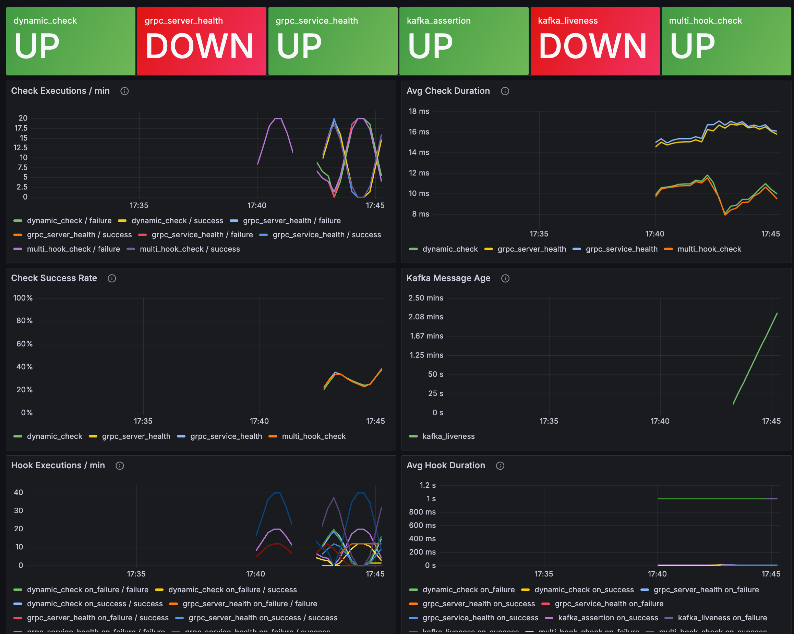

```
 __        __    _       _     ____
 \ \      / /_ _| |_ ___| |__ |  _ \  __ ___      ______ _
  \ \ /\ / / _` | __/ __| '_ \| | | |/ _` \ \ /\ / / _` |
   \ V  V / (_| | || (__| | | | |_| | (_| |\ V  V / (_| |
    \_/\_/ \__,_|\__\___|_| |_|____/ \__,_| \_/\_/ \__, |
                                                     |___/
```

# Watchdawg

A dynamic, extensible health-checking daemon written in Go. It reads a JSON config file, runs scheduled health checks against external systems, and fires webhook notifications on success or failure.

## Features

- **Multiple Check Types**
  - HTTP checks with customizable methods, headers, expected status codes, and Starlark assertions
  - gRPC standard health protocol (`grpc.health.v1.Health/Check`)
  - Kafka consumer liveness — checks that messages arrive within the schedule interval
  - Starlark-based checks for arbitrary custom logic
  - Retries and per-check timeouts

- **Flexible Scheduling**
  - Interval format: `30s`, `5m`, `1h`, `2h30m`
  - Standard cron expressions (seconds precision)

- **Webhook Notifications**
  - HTTP and Kafka notification hooks
  - Multiple hooks per success/failure event (fired in parallel)
  - Go template support for custom notification bodies

- **Execution History**
  - Optional SQLite-backed result store
  - Global and per-check retention limits
  - Opt-in recording per check or globally

- **Monitoring**
  - Optional Prometheus metrics exposition

## Quick Start

### Prerequisites

- Go 1.24 or higher

### Installation

```bash
git clone <your-repo-url>
cd watchdawg
go build -o bin/watchdawg ./cmd/watchdawg
```

### Basic Usage

```bash
cp configs/config.example.json configs/config.json
# Edit configs/config.json with your health checks

./bin/watchdawg -config configs/config.json
LOG_FORMAT=json ./bin/watchdawg -config configs/config.json  # JSON logs
```

## Configuration

### Loading Config

**File (default)**
```bash
./bin/watchdawg -config configs/config.json
```

**Stdin** — pipe from anywhere
```bash
# From a remote URL
curl -s https://example.com/watchdawg.json | ./bin/watchdawg -config -

# From a secret manager
vault kv get -field=config secret/watchdawg | ./bin/watchdawg -config -

# From a YAML file (requires yq)
yq -o=json configs/config.example.yaml | ./bin/watchdawg -config -
```

A YAML reference config is available at `configs/config.example.yaml`.

**Environment variable substitution** — use `$VAR` or `${VAR}` anywhere in the JSON:
```json
{
  "http": {
    "url": "https://${API_HOST}/health",
    "headers": { "Authorization": "Bearer $API_TOKEN" }
  }
}
```
Variables are expanded from the process environment before parsing. Unset variables expand to an empty string.

### Basic Structure

```json
{
  "metrics": {
    "type": "prometheus",
    "address": "127.0.0.1:9090"
  },
  "history": {
    "db_path": "./watchdawg.db",
    "retention": 1000
  },
  "healthchecks": [
    {
      "name": "my-api-check",
      "schedule": "30s",
      "retries": 2,
      "timeout": 5000000000,
      "http": { },
      "on_success": [ { "http": { } } ],
      "on_failure": [ { "http": { } } ]
    }
  ]
}
```

The check type is determined by which key is present (`http`, `starlark`, `kafka`, or `grpc`) — exactly one must be set per check.

`timeout` is in nanoseconds (`5000000000` = 5s). Defaults to 30s if omitted.

### Check Types

#### HTTP Checks

```json
{
  "name": "api-health",
  "schedule": "1m",
  "retries": 3,
  "timeout": 10000000000,
  "http": {
    "url": "https://api.example.com/health",
    "method": "GET",
    "headers": {
      "Authorization": "Bearer token123"
    },
    "expected": {
      "status_code": 200
    }
  }
}
```

HTTP check with JSON assertion:
```json
{
  "name": "api-json-validation",
  "schedule": "1m",
  "retries": 2,
  "timeout": 10000000000,
  "http": {
    "url": "https://api.example.com/status",
    "method": "GET",
    "expected": {
      "status_code": 200,
      "format": "json"
    },
    "assertion": "result['status'] == 'healthy' and result.get('uptime', 0) > 0"
  }
}
```

HTTP check with multiple acceptable status codes and header validation:
```json
{
  "name": "api-with-headers-check",
  "schedule": "1m",
  "http": {
    "url": "https://api.example.com/data",
    "method": "GET",
    "expected": {
      "status_code": [200, 201, 202],
      "format": "json",
      "headers": {
        "Content-Type": "application/json"
      }
    },
    "assertion": "result['status'] == 'ok' and result.get('count', 0) > 5"
  }
}
```

HTTP check with TLS verification disabled (e.g. self-signed certs):
```json
{
  "name": "dev-api-health",
  "schedule": "1m",
  "http": {
    "url": "https://dev-api.example.com/health",
    "method": "GET",
    "expected": {
      "status_code": 200,
      "verify_tls": false
    }
  }
}
```

#### Expected Response Configuration

| Field | Required | Description |
|---|---|---|
| `status_code` | Yes | Single int or array of ints (e.g. `200` or `[200, 201]`) |
| `format` | No | `"json"` or `"xml"` — parses body into `result` for assertions |
| `headers` | No | Map of headers that must match exactly |
| `verify_tls` | No | Default `true`. Set to `false` to skip TLS cert validation |

#### Assertion Modes

**Simple expression** (recommended):
```json
"assertion": "status_code == 200 and 'success' in body"
```
Automatically wrapped as `valid = <expression>`. Available variables: `status_code`, `body`, `body_size`, `headers`, and `result` (when `format` is set).

**Full Starlark script** (for complex logic):
```json
"assertion": "valid = status_code == 200\nif valid:\n  message = 'Success'\nelse:\n  message = 'Failed'"
```
Must set `valid` (or `healthy`). Optionally set `message` for custom log output.

#### gRPC Checks

Uses the standard `grpc.health.v1.Health/Check` protocol.

```json
{
  "name": "grpc-server-health",
  "schedule": "30s",
  "retries": 2,
  "timeout": 5000000000,
  "grpc": {
    "target": "myservice:50051",
    "plaintext": true
  }
}
```

Check a specific service (leave `service` empty for a server-level check):
```json
{
  "name": "grpc-service-health",
  "schedule": "30s",
  "grpc": {
    "target": "myservice:50051",
    "plaintext": true,
    "service": "my.package.MyService"
  }
}
```

| Field | Description |
|---|---|
| `target` | `host:port` of the gRPC server |
| `plaintext` | Skip TLS (common for internal services) |
| `verify_tls` | `false` to accept self-signed certs |
| `service` | Fully-qualified service name; empty = server-level check |

#### Kafka Checks

Checks that at least one message was received on the topic within the schedule interval. Reports healthy while waiting for the first message after startup.

> Kafka checks require a duration-format schedule (e.g. `30s`, `5m`) — cron expressions are not supported.

```json
{
  "name": "order-events-liveness",
  "schedule": "30s",
  "timeout": 5000000000,
  "kafka": {
    "brokers": ["localhost:9092"],
    "topic": "orders",
    "group_id": "watchdawg-order-events"
  }
}
```

Kafka check with assertion on the latest message:
```json
{
  "name": "payment-events-validation",
  "schedule": "1m",
  "timeout": 5000000000,
  "kafka": {
    "brokers": ["localhost:9092"],
    "topic": "payments",
    "format": "json",
    "assertion": "result.get('status') in ('completed', 'pending')"
  }
}
```

Available assertion variables: `value` (string), `key` (string), `headers` (dict), `result` (parsed when `format` is set).

`group_id` defaults to `watchdawg-<check-name>` if omitted.

#### Starlark Checks

```json
{
  "name": "custom-logic",
  "schedule": "2m",
  "retries": 1,
  "timeout": 15000000000,
  "starlark": {
    "script": "healthy = True\nmessage = 'Check passed'\n",
    "globals": {
      "threshold": 100,
      "api_url": "https://api.example.com"
    }
  }
}
```

The script must set `healthy` (or `valid`) to a boolean. Optionally set `message`.

### Webhook Notifications

`on_success` and `on_failure` are arrays of hook configs. Multiple hooks fire in parallel. Each entry is a tagged union with exactly one type key (`http` or `kafka`).

**HTTP hook:**
```json
{
  "on_failure": [
    {
      "http": {
        "url": "https://webhook.site/your-webhook",
        "method": "POST",
        "headers": {
          "Content-Type": "application/json"
        },
        "body_template": "ALERT: {{.CheckName}} failed: {{.Message}}"
      }
    }
  ]
}
```

**Kafka hook:**
```json
{
  "on_failure": [
    {
      "kafka": {
        "brokers": ["localhost:9092"],
        "topic": "health-alerts",
        "message_template": "Check '{{.CheckName}}' failed: {{.Message}}"
      }
    }
  ]
}
```

**Multiple hooks:**
```json
{
  "on_failure": [
    { "http": { "url": "https://webhook.site/...", "method": "POST" } },
    { "kafka": { "brokers": ["localhost:9092"], "topic": "health-alerts" } }
  ]
}
```

If `body_template`/`message_template` is omitted, the full check result is sent as JSON. Template variables: `{{.CheckName}}`, `{{.Message}}`, `{{.Timestamp}}`.

### Execution History

Add a `history` block to enable SQLite-backed result recording:

```json
{
  "history": {
    "db_path": "./watchdawg.db",
    "retention": 1000,
    "record_all_healthchecks": false
  }
}
```

| Field | Description |
|---|---|
| `db_path` | Path to the SQLite database file |
| `retention` | Max results to retain globally (default: 1000) |
| `record_all_healthchecks` | If `true`, all checks are recorded automatically |

Per-check recording (when `record_all_healthchecks` is false):
```json
{
  "name": "api-health",
  "record": true,
  "retention": 500,
  "http": { }
}
```

### Scheduling

| Format | Example | Description |
|---|---|---|
| Interval | `30s`, `5m`, `1h`, `2h30m` | Runs every N duration |
| Cron | `0 */5 * * * *` | 6-field cron with seconds precision |

## Monitoring

Watchdawg exposes Prometheus metrics at the address configured in the `metrics` block. A pre-built Grafana dashboard is included.



Start the monitoring stack alongside the main service:

```bash
docker compose up grafana
```

Grafana will be available at `http://localhost:3000` with the dashboard pre-provisioned (anonymous read access enabled by default).

## Project Structure

```
.
├── cmd/
│   └── watchdawg/              # Application entrypoint
├── internal/
│   ├── healthcheck/            # Scheduler, checkers, hooks, history
│   │   ├── scheduler.go        # Check orchestration
│   │   ├── http.go             # HTTP checker
│   │   ├── grpc.go             # gRPC checker
│   │   ├── kafka.go            # Kafka checker
│   │   ├── starlark.go         # Starlark checker
│   │   ├── hooks.go            # Hook dispatch (HTTP + Kafka)
│   │   ├── history_recorder.go # Execution history persistence
│   │   └── metrics_recorder.go # Prometheus metrics
│   ├── config/                 # Config loading and validation
│   ├── models/                 # Config and result types
│   ├── starlarkeval/           # Shared Starlark execution utilities
│   └── metrics/                # Prometheus metrics server
├── configs/
│   ├── config.example.json     # Full config reference
│   └── config.example.yaml     # YAML equivalent reference
└── integration-tests/          # Docker Compose + pytest integration tests
```

## Roadmap

- [ ] Starlark HTTP client for making requests from scripts

## License

TBD
